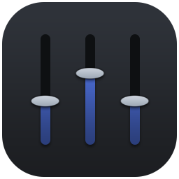

  

<h1 align="center">WaveShaper - Feature Reference</h1>

  <b>The complete per-page, per-control reference for WaveShaper.</b> 
  Looking for install / license / quick-start instead? See <a href="README.md">README.md</a>.

This document explains what every page, panel, slider and option box does — and what it actually does to your audio under the hood.

## **Table of Contents**

1. [Understanding the Equalizer](#understanding-the-equalizer)
   - [Frequency Bands](#frequency-bands)
   - [Quality Levels](#quality-levels)
   - [HP/LP Filter Slope](#hplp-filter-slope)
   - [EQ Response Types](#eq-response-types)
   - [Built-in Presets](#built-in-presets)
   - [Custom Presets](#custom-presets)
   - [Preset Modes](#preset-modes)
2. [Audio Effects](#audio-effects)
   - [Time Stretching](#time-stretching)
   - [Reverb and Space](#reverb-and-space)
   - [Delay](#delay)
   - [Saturation](#saturation)
   - [Modulation](#modulation)
   - [Creative Effects](#creative-effects)
   - [Per-Panel Enable Checkboxes](#per-panel-enable-checkboxes)
3. [Dynamic Compression](#dynamic-compression)
   - [What Compression Does](#what-compression-does)
   - [Compression Presets](#compression-presets)
   - [Compressor Controls](#compressor-controls)
   - [Advanced Compressor (Envelope Smoothing + Knee Width)](#advanced-compressor-envelope-smoothing--knee-width)
   - [Multiband Compressor](#multiband-compressor)
   - [Gate and Expander](#gate-and-expander)
4. [Mastering Suite](#mastering-suite)
   - [Mastering Meter](#mastering-meter)
   - [Mastering Presets](#mastering-presets)
   - [Limiter](#limiter)
   - [Stereo and Effects](#stereo-and-effects)
5. [Visualization and Monitoring](#visualization-and-monitoring)
6. [Managing Your Library](#managing-your-library)
7. [Audio Playback](#audio-playback)
   - [Playback Modes](#playback-modes)
   - [Audio Modes](#audio-modes)
   - [Audio Enhancement Sliders](#audio-enhancement-sliders)
   - [Player Controls](#player-controls)
8. [Preset Management](#preset-management)
9. [Configuring Audio Settings](#configuring-audio-settings)
10. [Engine Internals](#engine-internals)

## **Understanding the Equalizer**

An equalizer is one of the most powerful tools for shaping your audio. It allows you to boost or cut specific frequency ranges, making instruments or voices more prominent, removing unwanted rumble or adding brightness and clarity. WaveShaper's 10-band parametric equalizer uses State Variable Filter (SVF-TPT) topology with zero-delay feedback integrators, providing sample-rate independent, numerically stable processing across the entire audible spectrum.

### **Frequency Bands**

The equalizer divides the audio spectrum into ten bands, each targeting a specific frequency range. Understanding what each band affects helps you make better mixing decisions:

| Band | Frequency | What It Controls |
|------|-----------|------------------|
| Band 1 | `32 Hz` | Sub-bass, the lowest frequencies you feel more than hear. Adds rumble and weight. |
| Band 2 | `64 Hz` | Bass fundamentals. Controls the punch and power of kick drums and bass instruments. |
| Band 3 | `125 Hz` | Upper bass. Adds warmth but can also cause muddiness if boosted too much. |
| Band 4 | `250 Hz` | Low-midrange. Affects the body of vocals and the fullness of guitars. |
| Band 5 | `500 Hz` | Midrange. The core of most instruments and voices. Crucial for clarity. |
| Band 6 | `1 kHz` | Upper-midrange. Affects presence and can make sounds feel closer or farther away. |
| Band 7 | `2 kHz` | Presence range. Boosting here adds bite to guitars and clarity to vocals. |
| Band 8 | `4 kHz` | Brilliance. Enhances consonants in speech and attack in percussion. |
| Band 9 | `8 kHz` | High frequencies. Adds air and sparkle to the overall mix. |
| Band 10 | `16 kHz` | Ultra-high frequencies. Adds shimmer and openness, though less audible on lower-quality systems. |

Each band has an adjustable **Q-Factor** (ranging from `0.1` to `10.0`) that controls bandwidth. A low Q value affects a wide range of frequencies around the center point, while a high Q value makes surgical, narrow adjustments.

### **Quality Levels**

WaveShaper offers four quality levels that determine how much gain adjustment is available on each band:

- **Standard** (±6 dB): Suitable for subtle corrections and gentle tone shaping without risk of distortion.
- **Enhanced** (±12 dB): The default setting, providing enough headroom for most mixing tasks.
- **Professional** (±18 dB): For significant frequency corrections when audio needs major reshaping.
- **Extreme** (±24 dB): Maximum adjustment range for sound design and creative frequency manipulation.

### **HP/LP Filter Slope**

When you switch a band's filter type to **High Pass** or **Low Pass** in the Advanced EQ panel, the **Slope** row becomes active and offers six slope options:

| Slope | Stages | Behavior |
|---|---|---|
| **6 dB/oct** | 1 SVF | Extremely gentle roll-off. Audible blend between in-band and out-of-band. |
| **12 dB/oct** | 1 SVF | Standard analog-style filter (Butterworth-like). The default. |
| **18 dB/oct** | 1.5 SVF | Slightly steeper, retains musicality. |
| **24 dB/oct** | 2 SVF | Common in subtractive synthesizers and crossovers. Defined cutoff. |
| **36 dB/oct** | 3 SVF | Surgical removal of rumble or hiss without affecting nearby content. |
| **48 dB/oct** | 4 SVF | Brick-wall behaviour. Effectively cuts everything past the cutoff. |

For any other filter type (Bell, Lo Shelf, Hi Shelf, Band Pass, Notch, Tilt) the Slope row is shown disabled — same disabled-row pattern that's used across the app, so you can always see the control exists without it being interactable.

### **EQ Response Types**

Three response curves are available, each with different characteristics:

- **Linear:** Straight-line connections between EQ points for a clear, analytical display.
- **Sharp Stepped:** Precise stepped response with defined transitions between adjacent bands.
- **Smooth Bezier:** Gradual Bezier-curve interpolation between bands for a natural, flowing EQ shape.

### **Built-in Presets**

WaveShaper includes 44 professionally-tuned presets to help you get started quickly:

**Genre Presets:** Each genre preset is optimized for the typical frequency balance of that music style.
- Rock, Pop, Jazz, Classical, Hip Hop, Electronic, R&B, Metal, Reggae, Country, Latin, Acoustic, Dance, Club, Party, Techno, Trance, Soft Rock, Ska, Blues, Soul, Funk, K-Pop, Ambient

**Utility Presets:** Designed for specific corrective or enhancement purposes.
- **Flat:** Neutral starting point with no adjustments
- **Bass Boost / Treble Boost:** Quick low or high frequency enhancement
- **Deep Bass:** Extreme sub-bass enhancement for bass-heavy music
- **Vocal:** Emphasizes the presence range for clearer voice
- **Bass Reducer:** Cuts low frequencies for cleaner sound on small speakers
- **Loudness:** Classic loudness curve for low-volume listening
- **Headphones:** Optimized for headphone playback
- **Small Speakers:** Compensates for speakers that lack bass response
- **Live:** Adds presence and energy typical of live performances
- **Powerful:** Aggressive V-shaped curve with boosted bass and treble

**Specialized Presets:** Optimized for specific content types and use cases.
- **Podcast:** Speech clarity optimization with enhanced mid-range
- **Spoken Word:** Similar to Podcast but with more aggressive voice focus
- **Gaming:** Spatial audio enhancement for games with balanced effects
- **Piano:** Warm mid-range focus for keyboard and piano music
- **Cinema:** Full spectrum enhancement for movie soundtracks and immersive audio
- **Full Bass:** Extreme low-end emphasis across the sub and bass range for bass-heavy listening
- **Full Treble:** Extreme high-frequency boost with rolled-off lows for air, sparkle and brilliance
- **Lofi:** Rolled-off highs and warm lows for a vintage lofi character
- **Soft:** Gentle, relaxed sound with reduced highs for easy listening

### **Custom Presets**

WaveShaper allows you to create and manage your own custom EQ presets:

**Automatic Custom Mode:**
When you select a preset and then manually adjust any equalizer band, the preset selection automatically switches to "Custom". This indicates that your current EQ settings no longer match any saved preset and are your own custom configuration.

**Saving Custom Presets:**
1. Adjust the equalizer bands to your desired settings (on the Equalizer page or by modifying any preset).
2. Navigate to the **Presets** page.
3. Enter a name for your preset in the text field at the top.
4. Click the **Save Preset** button to store your custom preset.

**Managing Custom Presets:**
- Custom presets appear alongside the built-in presets in the dropdown list.
- You can overwrite an existing custom preset by saving with the same name.
- Delete custom presets using the Delete Preset button (built-in presets cannot be deleted).
- Export and import presets to share or backup your configurations.
- Add optional descriptions and tags to organize your preset collection.
- Maximum of 50 custom presets can be saved.

### **Preset Modes**

WaveShaper offers three intelligent modes for automatic preset selection, accessible on the Presets page:

| Mode | Description |
|------|-------------|
| **Manual** | Full control over preset selection. Choose presets manually from the dropdown menu. Your selection persists until you change it. Ideal when you know exactly which EQ curve you want. |
| **Keyword** | Filename-based detection. WaveShaper analyzes the audio filename for genre keywords (e.g., "rock", "jazz", "vocal", "bass", "podcast") and automatically applies a matching preset when a file is loaded. Fast and lightweight. |
| **Analyze** | Intelligent FFT frequency analysis. When a file is loaded, WaveShaper performs real-time spectral analysis of the audio content and automatically selects the best-matching preset based on the actual sound characteristics. |

**Keyword Mode Keywords:**
Keyword mode recognizes the following words in filenames:
- `vocal`, `voice`, `speech` → **Vocal**
- `rock`, `metal` → **Rock**
- `jazz` → **Jazz**
- `classical`, `orchestra` → **Classical**
- `piano` → **Piano**
- `bass`, `hip`, `rap` → **Hip Hop**
- `podcast`, `interview` → **Podcast**
- `game`, `gaming` → **Gaming**
- `dance`, `club` → **Dance**
- `cinema`, `movie`, `film` → **Cinema**
- And more...

**How Analyze Mode Works:**

Analyze mode uses Fast Fourier Transform (FFT) analysis to understand the frequency content of your audio:

1. **Multi-Point Sampling:** Analyzes the frequency spectrum at multiple positions (10s, 30s, 60s) to get a representative sample of the entire track.
2. **6-Band Energy Analysis:** Calculates energy distribution across six frequency bands:
   - Sub-Bass & Bass (20-120 Hz)
   - Low-Mid / Warmth (120-400 Hz)
   - Mid / Vocals & Instruments (400-2500 Hz)
   - High-Mid / Presence (2500-5000 Hz)
   - Treble / Brilliance (5000-10000 Hz)
   - Presence / Air (10000+ Hz)
3. **Pattern Matching:** Compares the frequency profile against 44 preset characteristics to find the closest match.
4. **Automatic Application:** Applies the best-matching preset and updates the Active Preset display.

**Example Analyze Mode Detections:**
- Heavy sub-bass with warm low-mids → **Deep Bass** (e.g., dubstep, trap music)
- Strong mids with minimal highs → **Classical** or **Piano** (e.g., symphony, piano sonata)
- Full spectrum with presence in all bands → **Cinema** (e.g., movie soundtrack, orchestral score)
- Bass + highs with scooped mids → **Electronic** or **Dance** (e.g., EDM, house music)
- Speech-focused with clear mid-range → **Podcast** or **Spoken Word** (e.g., audiobook, interview)

## **Audio Effects**

Beyond equalization, WaveShaper provides a comprehensive suite of audio effects that can transform your sound from subtle enhancement to dramatic creative manipulation. The Effects page is organized into seven panels: Time Stretch, Reverb, Delay, Saturation, Modulation, Creative FX and Action Buttons. Each effect panel (except Actions) has a top-right **enable checkbox** so you can bypass it without losing your tweaks.

### **Time Stretching**

Time stretching allows you to change the tempo of audio without affecting its pitch, or shift pitch without changing tempo. This is essential for tempo matching, creative effects and correcting pitch issues.

**Processing Modes:** Standard, High Quality, Best Quality, Low Latency, Maximum Quality

**Algorithms:**
- **PSOLA:** Best for monophonic sources like vocals
- **WSOLA:** Good general-purpose algorithm
- **Phase Vocoder:** Preserves harmonic content well
- **Granular:** Suitable for extreme stretching
- **Harmonic-Percussive:** Separates and processes tonal and rhythmic content independently

**Speed Range:** `0.25x` to `4.0x` playback speed
**Pitch Shift:** `-12` to `+12` semitones (one full octave up or down)
**Preserve Formants:** When enabled, pitch shifting retains natural vocal and instrument character, preventing unnatural resonance effects that occur when shifting pitch without formant correction.

### **Reverb and Space**

Reverb simulates the natural reflections of sound in physical spaces. When you clap your hands in a large hall, you hear the sound bounce off walls and decay over time. WaveShaper's reverb engine uses an 8-line Feedback Delay Network (FDN) with a Hadamard mixing matrix for energy-preserving, colorless reverb tails, combined with a 4-stage allpass input diffuser and per-line modulated delay for natural spatial depth.

Six reverb environments are available:

- **Room:** Small room ambience, subtle and natural
- **Hall:** Concert hall with longer decay for orchestral depth
- **Cathedral:** Very large space with extended reverb tail
- **Chamber:** Studio recording room simulation
- **Plate:** Classic studio reverb with smooth, dense decay
- **Spring:** Vintage spring reverb character

Each reverb type can be fine-tuned with seven parameters:
- **Pre-Delay** (0-200 ms): The gap before reverb onset, creating a sense of distance
- **Decay Time:** How long the reverb tail lasts
- **Room Size:** How large the simulated space feels
- **HF Damping:** How quickly high frequencies decay, for natural or bright tails
- **Stereo Width** (0.0–2.0): M/S width of the wet tail. 0 collapses the reverb to mono, 1.0 is the natural FDN stereo image, 2.0 exaggerates the sides. Useful when reverb needs to sit narrower than its source (e.g. mono vocals into a stereo bus) or wider for cinematic openness.
- **Diffusion** (0.30–0.85): Allpass diffuser feedback. Low values keep early reflections distinct (Room / Chamber feel), high values build a dense washy tail (Hall / Plate feel) faster.
- **Dry/Wet:** The balance between original and reverberant signal

### **Delay**

Delay creates echoes by repeating the audio signal after a set time interval. WaveShaper's delay engine uses Thiran allpass fractional interpolation for smooth sub-sample accuracy with soft saturation in the feedback path. Six delay modes are available:

- **Simple:** Single repeat for basic echo effects
- **Ping-Pong:** Alternates between left and right speakers for spacious stereo effects
- **Multi-Tap:** Multiple delay times create rhythmic patterns
- **Filtered:** Delay with frequency filtering for darker, more vintage echoes
- **Stereo:** Independent delay times for each channel
- **Reverse:** Reversed delay trails for creative sound design

Delay parameters:
- **Delay Time** (up to 1000 ms): Time between echoes
- **Feedback:** How many times the delay repeats
- **Dry/Wet:** Blend between the original signal and the delayed output
- **High-Cut** (100–20 000 Hz): Low-pass filter on the feedback path. Set around 4–8 kHz for warm vintage delays; leave at 20 kHz for clean digital echoes.
- **Low-Cut** (20–2 000 Hz): High-pass filter on the feedback path. Useful to keep low rumble or bass out of the repeats so the delay doesn't muddy the mix.

The sidebar **DELAY DIVISION** option determines tempo-sync intervals (1/1, 1/2, 1/4, 1/8, 1/16, 1/32, 1/4 dotted, 1/2 triplet) when sync is enabled.

### **Saturation**

Saturation adds harmonic distortion and warmth to your audio, emulating the pleasant characteristics of analog hardware. WaveShaper's saturation engine uses first-order Antiderivative Anti-Aliasing (ADAA) with closed-form antiderivatives for each model, suppressing aliasing artifacts by approximately 40 dB compared to naive waveshaping. Five saturation models are available:

- **Tape:** Warm, smooth saturation inspired by magnetic tape recorders
- **Tube:** Rich harmonic distortion with the character of vacuum tube amplifiers
- **Transistor:** Tighter, more aggressive clipping with solid-state character
- **Diode:** Asymmetric clipping for a raw, edgy distortion
- **Hard Clip:** Digital hard clipping for extreme distortion effects

Saturation parameters: **Drive Amount** (intensity of the effect), **Dry/Wet** (blend between clean and saturated signal) and **Output Gain** (compensate for volume changes).

### **Modulation**

Modulation effects add movement and animation to your audio by varying parameters over time using a PolyBLEP anti-aliased low-frequency oscillator (LFO). Chorus and flanger use Bucket Brigade Device (BBD) emulation with Thiran allpass fractional delay interpolation, while the phaser implements a 6-stage cascaded allpass chain.

Six modulation types are selectable from the **MODULATION** sidebar:

- **Tremolo:** Volume modulation creates a wavering, pulsing effect
- **Vibrato:** Pitch modulation adds subtle pitch variation for a natural, animated sound
- **Pan Modulation:** Stereo position sweeps left and right automatically for spatial movement
- **Chorus:** Multi-voice delay modulation creates a thick, ensemble-like sound
- **Phaser:** Allpass filter chain with LFO modulation for sweeping, jet-like tones
- **Flanger:** Short delay modulation produces metallic, swooshing effects

The main panel automatically shows only the controls relevant to the active type:

| Type | Visible Controls |
|---|---|
| **No Modulation** | Tremolo controls shown disabled (panel never reads as empty) |
| **Tremolo / Vibrato / Pan / Phaser / Flanger** | LFO Shape, Rate, Depth |
| **Chorus** | LFO Shape, Rate, Depth, Voices (2–6), Chorus Mix |

**LFO Shape** options:
- **Sine:** Smooth, classic modulation
- **Triangle:** Sharper turnaround at peak/trough, more pronounced articulation
- **Square:** PolyBLEP-corrected hard-switch, useful for trance-gate-style effects

**Chorus Voices** (Chorus type only): how many delayed copies feed the chorus engine. 2 voices = thin, ensemble-of-two feel. 6 voices = lush, orchestral chorus.

**Chorus Mix** (Chorus type only): wet/dry balance independent of Depth — Depth controls modulation intensity, Mix controls how much of the chorused signal is blended into the output.

### **Creative Effects**

For more experimental sound design, WaveShaper includes seven creative effects built with overlap-add (OLA) windowing, TPDF dithered quantization and Hann-windowed granular synthesis. The active effect is chosen from the **CREATIVE FX** sidebar; the main panel **only shows the controls for that effect** (when "Normal" is selected the Stutter panel is shown disabled, so the panel is never empty).

| Effect | Visible Controls | What It Does |
|---|---|---|
| **Reverse** | Reverse Mix (0–100%) | Plays audio backwards using double-buffered OLA with Hann crossfade for seamless transitions |
| **Stutter** | Length (20–200 ms), Repeats (1–16) | Creates rhythmic chopping effects by repeating short segments with envelope shaping |
| **Gate** | Rate, Threshold, Shape (Sine / Triangle / Square / Pulse), Attack, Release | LFO-modulated amplitude gating with multiple waveform shapes for rhythmic silence patterns |
| **Bitcrush** | Bit Depth (1–16), Sample Rate Reduction (1–64x), Crush Mix, Overdrive (toggle) | Reduces bit depth with TPDF dithering for lo-fi, digital distortion character |
| **Lo-Fi** | Amount, Mix | Degrades audio quality for vintage, nostalgic sound textures |
| **Ring Mod** | Frequency (20–6 000 Hz), Amount | Ring modulation produces metallic, bell-like tonal effects |
| **Granular** | Amount | Breaks audio into tiny grains for textural, ambient manipulation |

### **Per-Panel Enable Checkboxes**

The top-right corner of each effect panel has a small enable checkbox. Toggling it off bypasses just that block while leaving your parameters intact — you can A/B the panel against the rest of the chain without resetting anything. Panels with their own enable checkbox:

- Time Stretch / Pitch
- Reverb
- Delay
- Saturation
- Modulation
- Creative FX

The same pattern is used on the Compressor panel, Multiband panel, EQ panel and Limiter panel.

## **Dynamic Compression**

### **What Compression Does**

Dynamic compression is essential for controlling the volume differences in audio. Without compression, quiet parts might be too soft while loud parts distort or overpower the mix. A compressor automatically reduces the volume of signals that exceed a certain threshold, creating a more consistent and professional sound. WaveShaper's compressor uses logarithmic gain computation in the dB domain with branching smooth ballistics for transparent dynamics control.

Think of compression like an automatic volume control that turns down the loud parts. This allows you to then raise the overall level, making quiet details more audible while preventing peaks from distorting.

### **Compression Presets**

Six purpose-built presets provide optimized starting points:

| Preset | Best For |
|--------|----------|
| **Vocal** | Spoken word, singing, podcasts |
| **Drums** | Drum loops, percussion, rhythmic material |
| **Bass** | Bass instruments, sub-heavy content |
| **Master** | Full mixes and mastering chains |
| **Gentle** | Subtle leveling without audible compression |
| **Custom** | Your own settings |

Each preset automatically configures the compressor parameters (threshold, ratio, attack, release, makeup gain and mix level) for the target material. You can further adjust any parameter after selecting a preset.

### **Compressor Controls**

The compressor provides precise control over dynamics processing:

- **Release** (Fast, Medium, Slow, Custom): How quickly compression disengages after the signal drops below threshold
- **Ratio** (1:1 to 20:1): The amount of gain reduction applied. Higher ratios mean more aggressive compression. Ratios above 10:1 approach limiting behavior.
- **Threshold** (-60 dB to 0 dB): The level above which compression begins. Lower thresholds compress more of the signal.
- **Attack** (1-500 ms): How quickly the compressor responds to signals exceeding the threshold
- **Makeup Gain** (0-24 dB): Compensates for the volume loss from compression
- **Parallel Mix** (0-100%): Blends compressed and uncompressed signals for parallel compression

**Additional Controls:**
- **Auto Makeup Gain:** Automatically compensates for gain reduction
- **Soft/Hard Knee:** Controls the transition curve at the threshold. Soft knee provides gradual onset, hard knee provides immediate compression.

### **Advanced Compressor (Envelope Smoothing + Knee Width)**

A dedicated **ADVANCED COMPRESSOR** panel exposes two professional-grade controls that shape the *character* of the compression rather than its amount:

- **Envelope Smoothing** (0.001–0.01): Envelope-follower coefficient. Lower values give a punchier, more transient-responsive feel — peaks pump through faster. Higher values smooth the gain-reduction movement and produce a more transparent, levelling character.
- **Knee Width** (1.0–12.0 dB): Continuous knee width, independent of the Soft Knee on/off toggle. 1 dB = nearly hard knee; 12 dB = very soft gradual transition into compression. Soft Knee picks the *shape*, Knee Width controls *how wide* the soft transition is.

### **Multiband Compressor**

The **MULTIBAND COMPRESSOR** panel splits the signal into four frequency bands using SVF-TPT crossover filters and compresses each band independently. Useful when the spectrum has different dynamic problems at different frequencies — e.g. you want to tame a boomy low end without dulling the cymbals.

Toggle the panel on via the top-right checkbox, then tune each band:

| Band | Frequency Range | Threshold | Ratio |
|---|---|---|---|
| **Low** | < 200 Hz | -60 dB … 0 dB | 1.0 … 20.0 |
| **Low-Mid** | 200 Hz – 800 Hz | -60 dB … 0 dB | 1.0 … 20.0 |
| **High-Mid** | 800 Hz – 3 kHz | -60 dB … 0 dB | 1.0 … 20.0 |
| **High** | > 3 kHz | -60 dB … 0 dB | 1.0 … 20.0 |

When multiband is off, the standard single-band compressor section drives the dynamics.

### **Gate and Expander**

The Gate/Expander section removes unwanted noise and bleed from recordings by attenuating audio that falls below a set threshold:

- **Gate Threshold** (-80 dB to 0 dB): Audio below this level is attenuated
- **Range/Depth** (-80 dB to 0 dB): How much the signal is reduced when gated
- **Attack** (0-50 ms): How quickly the gate opens when signal exceeds threshold
- **Release** (10-500 ms): How quickly the gate closes after signal drops below threshold
- **Hold** (0-200 ms): Minimum time the gate stays open after triggering, preventing chattering on transients

The Compressor page sidebar offers global mode switches for the entire dynamics section — **COMPRESSOR TYPE** (VCA / FET / Opto), **DETECTION MODE** (Peak / RMS / Hybrid), **COMPRESSION MODE** (Standard / Multi-band / Sidechain), **SIDECHAIN HPF** (Off / 80 / 100 / 150 / 200 / 300 Hz) and **DYNAMICS CONTROL** (Gentle / Aggressive / Transparent).

## **Mastering Suite**

The Mastering page provides professional-grade tools for the final stage of audio production. It combines loudness metering, limiting, stereo imaging and analog-style effects into a cohesive mastering workflow.

### **Mastering Meter**

The mastering meter provides real-time monitoring across three display modes:

- **Peak / LUFS:** Displays left and right channel peak levels alongside integrated LUFS (Loudness Units Full Scale) measurement for broadcast-standard loudness monitoring
- **True Peak:** Shows inter-sample peak levels that may exceed 0 dBFS in the digital domain, critical for streaming and broadcast compliance
- **Loudness:** Dedicated LUFS display with loudness range (LRA) analysis

The meter shows separate bars for Left (L), Right (R) and Integrated (I) measurements with tooltips displaying precise dB values on hover.

### **Mastering Presets**

Six mastering presets provide industry-standard starting points:

| Preset | Target | Best For |
|--------|--------|----------|
| **Streaming** | -14 LUFS | Spotify, Apple Music, YouTube |
| **Broadcast** | -23 LUFS | TV, radio, podcast distribution |
| **Loud Master** | -8 LUFS | Competitive loudness for EDM, pop |
| **CD Master** | -12 LUFS | Physical CD distribution |
| **Vinyl** | -16 LUFS | Warm vinyl-style mastering |
| **Custom** | Adjustable | Your own target loudness |

Each preset configures **Target Loudness** (-24 to -6 LUFS) and **Output Gain** (-12 to +12 dB) for the selected delivery format.

### **Limiter**

The brick-wall limiter prevents audio from exceeding a set ceiling, ensuring clean output without digital clipping.

Inline in the Limiter panel:
- **Style** combobox (five options): **Transparent**, **Punchy**, **Aggressive**, **Brickwall** and **Soft Clip** — each offering a different character from transparent peak control to saturated warmth.
- **Lookahead** (1, 2, 5 or 10 ms): Anticipates peaks for transparent limiting. Longer lookahead catches more peaks but adds latency.
- **Ceiling** (-30 to 0 dB): Maximum output level. Set to -1 dB or lower for safe headroom.
- **Release** (10-500 ms): How quickly the limiter disengages after peak reduction

**Limiter Options (option buttons):**
- **True Peak:** Enables inter-sample peak detection for accurate limiting
- **Auto Release:** Dynamically adjusts release time based on program material
- **Link Stereo:** Links left and right channel limiting to preserve stereo image

The panel can be bypassed entirely via the enable checkbox at the top-right.

### **Stereo and Effects**

The Stereo & Effects panel provides mastering-grade stereo and analog processing:

**Stereo Mode and Width:**
- **Mono / Narrow / Normal / Wide / Extra Wide:** Quick stereo width presets (option buttons inside the panel)
- **Width** (0-200%): Precise stereo width control from full mono (0%) to double-wide (200%)
- **Mid/Side** (-100 to +100): Balance between center (mid) and side content. Positive values emphasize sides for wider imaging, negative values emphasize center for focused mono content.

**Analog Effects:**
- **Exciter** (0-100%): Adds harmonic overtones and high-frequency sparkle for presence and air
- **Tape Saturation** (0-100%): Emulates the warm compression and harmonic richness of analog tape machines

The Mastering page sidebar contains three remaining option boxes — **MASTERING CHAIN** (Clean / Warm / Loud / Vintage), **MONO MAKER** (Off / 80 / 120 / 160 / 200 / 300 Hz) and **STEREO MONITOR** (Stereo / Left / Right / Mid / Side solo).

## **Visualization and Monitoring**

### **Spectrum Analyzer**

The real-time spectrum analyzer displays the frequency content of your audio, helping you identify problematic frequencies, verify EQ adjustments and ensure a balanced mix.

**Display Modes:**
- **Linear:** Equal spacing across frequencies
- **Logarithmic:** More resolution in lower frequencies (matches human hearing perception)
- **Smooth:** Averaged display for easier reading
- **Peak:** Shows maximum values with decay
- **RMS:** Shows average energy levels
- **Octave:** Groups frequencies into octave bands for simplified analysis
- **Avg Hold:** Displays running averages with peak hold indicators

### **Activity Dashboard**

The Dashboard tracks your usage patterns and provides an overview of your audio processing activities. It includes user activity charts, account information, workspace analysis and recent audio history with quick-access context menus for playback, file location and favorites.

## **Managing Your Library**

The Audio Library is your central hub for organizing audio files. Manual "My Audios" imports are limited to 200 audio files by default, with the limit adjustable up to 600 on the Library page. Synced Medio Folder and Music Folder sources are scanned separately and are not limited by the manual library cap.

**Importing Audio:**
- Drag and drop files directly onto the library
- Use the Import button to browse for files
- Files are automatically analyzed for format, duration and sample rate

**Sorting Options:**
- Name A-Z / Name Z-A
- Largest Size / Smallest Size
- Newest Date / Oldest Date

**Medio and Music Folder Sources:** If you have [Medio - Universal Downloader](https://github.com/BerndHagen/Medio-Universal-Downloader) installed, a Medio Integration toggle appears in Settings under General Settings. When enabled and signed in through Arctisoft Hub, WaveShaper can access your Medio download library (`Documents/Medio`) directly, allowing you to quickly load audio extracted from videos without navigating through folders. The Library can also scan your Windows Music folder as a separate source. Guest users without a signed-in account will not see Medio library content.

## **Audio Playback**

The Player page provides comprehensive audio playback with real-time visualization, multiple playback modes, audio enhancement and full transport controls.

### **Playback Modes**

Five playback modes control how tracks are sequenced:

- **Normal:** Plays tracks in library order
- **Shuffle:** Randomizes playback order
- **Repeat One:** Continuously loops the current track
- **Repeat All:** Loops through all tracks in the library
- **Smart Mix:** Intelligent sequencing that considers audio characteristics

### **Audio Modes**

Five audio processing modes enhance playback for different listening scenarios:

- **Standard:** Clean, unprocessed output for reference listening
- **Night Mode:** Reduces dynamic range and limits volume for quiet environments
- **3D Audio:** Spatial audio enhancement for headphone listening with virtual surround
- **Cinema:** Full spectrum enhancement with spacious staging for movie-like immersion
- **Concert:** Live concert simulation with room ambience and crowd energy

A **Mono Check** toggle collapses stereo to mono, allowing you to verify stereo compatibility of your mix.

### **Audio Enhancement Sliders**

In addition to the **ENHANCEMENT** preset selector in the sidebar (Standard / Loudness Boost / Spatial Audio), the player page exposes a dedicated **AUDIO ENHANCEMENT** panel with five independent sliders. These run as a baseline; the sidebar preset still layers on top.

| Slider | Range | What It Does |
|---|---|---|
| **Air Boost** | 0–12 dB | High-shelf above ~12 kHz for sparkle and air |
| **Warmth** | 0–12 dB | Low-shelf below ~250 Hz for body and weight |
| **Presence** | 0–12 dB | Peaking around 2–5 kHz for vocal/instrument clarity |
| **Harmonics** | 0–1 | Harmonic excitation amount (subtle saturation that adds upper harmonics) |
| **Stereo Width** | 0.0–2.0 | M/S stereo width — 0 collapses to mono, 1 is the natural source image, 2 doubles the side energy |

Any non-zero slider auto-enables the enhancement provider in the audio chain; with everything at zero (and Stereo Width at exactly 1.0) the provider is bypassed so there's no CPU cost.

### **Player Controls**

- **Volume:** Master output volume with trackbar control (0-100%)
- **Stereo Balance:** Adjust left/right balance (-100 to +100)
- **Loop Mode:** Automatically repeat the current track once playback finishes
- **Crossfade:** Smooth transition between tracks (Off, Short 1s, Medium 3s, Long 5s)
- **Dynamic Range:** Compressed (Narrow), Normal, Wide or Extreme dynamic range for playback
- **Transport:** Play, Stop, Previous and Next buttons for full playback control

## **Preset Management**

The Presets page provides advanced tools for organizing, comparing and managing your EQ presets beyond basic save and load functionality.

### **A/B Comparison**

Compare two preset configurations side-by-side during playback:

1. **Select Preset A / Preset B:** Choose a preset from the dropdown or select "(Current)" to use the active EQ state.
2. **Capture A / Capture B:** Capture the selected preset into slot A or B for comparison.
3. **Toggle A / B:** Instantly switch between the two captured states.
4. **Bypass:** Temporarily disable all EQ to compare with the unprocessed signal.
5. **Swap A↔B:** Exchange the contents of both slots.

This is essential for making informed mixing decisions by directly comparing different EQ approaches in real-time.

### **Preset Categories**

Advanced preset management features include:

- **Transition Mode:** Control how presets crossfade (Smooth, Instant or Crossfade)
- **Preset Quality:** Processing quality level (Basic, Standard, High, Ultra)
- **Complexity:** Adjust the processing complexity for the selected preset
- **Preset Morph (A/B):** Smoothly blend between two presets by sliding between them

## **Configuring Audio Settings**

The Settings page provides comprehensive control over audio processing, engine configuration and export parameters.

### **General Settings**

- **Startup View:** Choose which page opens when WaveShaper launches (Dashboard, Equalizer, Library, Player, Effects, Compress, Presets or Settings)
- **Audio Mode:** Global audio channel mode (Stereo, Mono or Surround)
- **Sample Rate:** Playback sample rate selection (44.1 kHz, 48 kHz, 88.2 kHz, 96 kHz, 176.4 kHz, 192 kHz)
- **Bit Depth:** Audio processing bit depth (16 Bit, 24 Bit, 32 Bit)
- **Latency Mode:** Balance between responsiveness and stability (Low, Normal, High)
- **Dithering Type:** Algorithm for reducing quantization artifacts when lowering bit depth:
  - None, RPDF (Rectangular), TPDF (Triangular), TPDF + High-pass, Noise Shaping 1 (Gentle), Noise Shaping 2 (Medium), Noise Shaping 3 (POW-r style)
- **Dithering:** Toggle dithering noise application when reducing bit depth
- **Medio Integration:** Enable or disable access to the Medio download library. This option only appears if [Medio - Universal Downloader](https://github.com/BerndHagen/Medio-Universal-Downloader) is installed on your system. Requires an Arctisoft account - guest users without a signed-in account will see no Medio library content.
- **Global Bypass:** Temporarily disable all EQ, compression and audio effects for A/B comparison

### **Processing Settings**

- **Real-Time Processing:** Toggle instant audio effect processing during playback for immediate feedback
- **Audio Quality:** Processing quality level (Low/Fast, Medium, High/Best, Ultra)
- **DSP Threads:** Number of processing threads (1-10) for parallel audio computation

### **Audio Engine**

- **Audio Driver:** Output driver selection (Standard WaveOut, WASAPI Shared, WASAPI Exclusive, DirectSound, ASIO)
- **Buffer Size:** Audio buffer size in samples (64, 128, 256, 512, 1024, 2048). Smaller buffers reduce latency, larger buffers improve stability.

### **Audio Devices**

- **Input Device:** Select the audio input device for recording or monitoring
- **Output Device:** Select the audio output device for playback

### **Audio Export**

- **Normalization:** Output level normalization (Off, Peak -1 dB, LUFS -14 Streaming, LUFS -16 Apple, LUFS -23 Broadcast)
- **Audio Quality:** Bitrate selection (MP3: 32-320 kbps, AAC: 48-256 kbps)
- **Export Format:** Output file format (WAV, FLAC, MP3, AAC, OGG)

Settings can be saved, imported from file, exported to file or reset to defaults using the action buttons.

### **Audio Diagnostics**

Accessible from the top menu bar. The diagnostics dialog summarises the current audio configuration (driver, buffer size, sample rate, bit depth, default input/output device, estimated latency, total device counts) and offers a one-click **Test Audio Output** that plays a 440 Hz → 1 kHz two-second test tone through the active output device.

**Hearing-confirmation flow.** After the tone plays, the dialog asks "Did you hear the test tone?" and offers **Yes, all clear** / **No, no sound** buttons. Saying Yes locks the result in as a healthy playback path. Saying No surfaces an ordered troubleshooting panel with one-click fixes you can run in sequence:

1. **Restart audio engine** — recreates the current output device. Fixes glitches after a driver hiccup or device sleep.
2. **Switch to WaveOut driver** — the most universally-compatible Windows driver. Works on every machine but with a bit of extra latency. (Only shown if you aren't already on WaveOut.)
3. **Switch to WASAPI Shared** — the modern default. Lower latency, shares the default output device. (Only shown if you aren't already on it.)
4. **Open Windows Sound Settings** — launches `ms-settings:sound` so you can confirm the right device is set as default and the system volume isn't muted.
5. **Test again** — replays the tone with the current settings.

Each step re-runs the test automatically (except "Open Sound Settings") so you don't have to click "Test" again between attempts.

### **Sidebar Option-Box Reset**

Right-clicking any option box in the right-hand sidebar (TIME DISPLAY, PERFORMANCE, FFT SIZE, MASTERING CHAIN, DELAY DIVISION, CARD DENSITY, MODULATION, etc.) opens the same two-item context menu used by every main panel — **Reset Module** and a disabled **Disable Module**. Choosing **Reset Module** reverts that one specific option back to its factory default without disturbing any other settings you've tuned, which is much less destructive than a full page reset or factory reset. **Disable Module** is greyed out because option boxes have no bypass concept — it's shown disabled rather than hidden so the menu layout is identical across every right-click target in the app.

## **Engine Internals**

A few implementation details worth knowing about — these don't usually surface in the UI but explain why the engine behaves the way it does.

### **Host-Rate Clamp**

WaveShaper's real-time DSP chain runs at a maximum host rate of **48 kHz**. If a loaded file's native rate is higher (96 kHz, 192 kHz, etc.) the source is resampled down to 48 kHz at the head of the chain using WDL's polyphase resampler. The reason is throughput: every provider in the chain (FFT analyzer, FDN reverb, multiband SVF crossovers, granular grain engine, etc.) does 2× to 4× more work per real-time second when the host rate is doubled or quadrupled. On modest hardware that extra workload can starve the audio thread, producing the symptom of "audio plays slow and stutters" on hi-res files.

Integer-ratio downsamples (96→48, 192→48) are essentially transparent and the perceptual loss versus running the DSP at 96 kHz is negligible — the relevant audio content is well below the Nyquist frequency of 48 kHz output even on hi-res sources.

**The export path is unaffected.** Export builds its own chain with its own resampler and renders the output at whatever sample rate the user selects, so masters intended for hi-res delivery still come out at 96 kHz / 192 kHz.

### **DSP Chain Order**

The realtime playback chain runs in this fixed order:

1. **Source / WaveChannel32** — file decode + sample format conversion
2. **Host-rate clamp** — `WdlResamplingSampleProvider` if source > 48 kHz
3. **Equalizer** — 10-band SVF-TPT
4. **Compressor** — single-band or multiband
5. **Reverb** — 8-line FDN
6. **Delay** — Thiran allpass with filtered feedback
7. **Stereo Width**
8. **Modulation** — Tremolo / Vibrato / Pan / Chorus / Phaser / Flanger
9. **Creative FX** — Reverse / Stutter / Gate / Bitcrush / Lo-Fi / Ring Mod / Granular
10. **Saturation** — 5 ADAA models
11. **Enhancement** — Air Boost, Warmth, Presence, Harmonics, Stereo Width (Player page sliders)
12. **Audio Mode** — Stereo / Mono / Surround handling
13. **Pitch / Tempo** — RealtimeSpeedResampler + RealtimePitchShift
14. **Dynamic Sample Provider** — meter taps, dithering, analyzer feeds

Each of the per-panel enable checkboxes simply flips the `Bypass` flag on its provider; the provider stays in the chain so toggling doesn't cause clicks or chain rebuilds.

### **Settings Persistence**

All UI state — including per-band EQ, per-band multiband threshold/ratio, modulation type and waveform, creative FX parameters per effect, the five player enhancement values, mastering chain, and every sidebar option — is persisted to JSON via Newtonsoft.Json on every change and restored on launch. Settings live under your roaming profile so they survive reinstalls.
